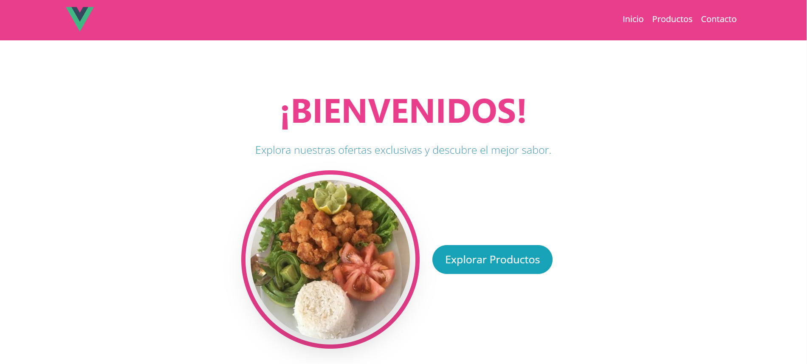
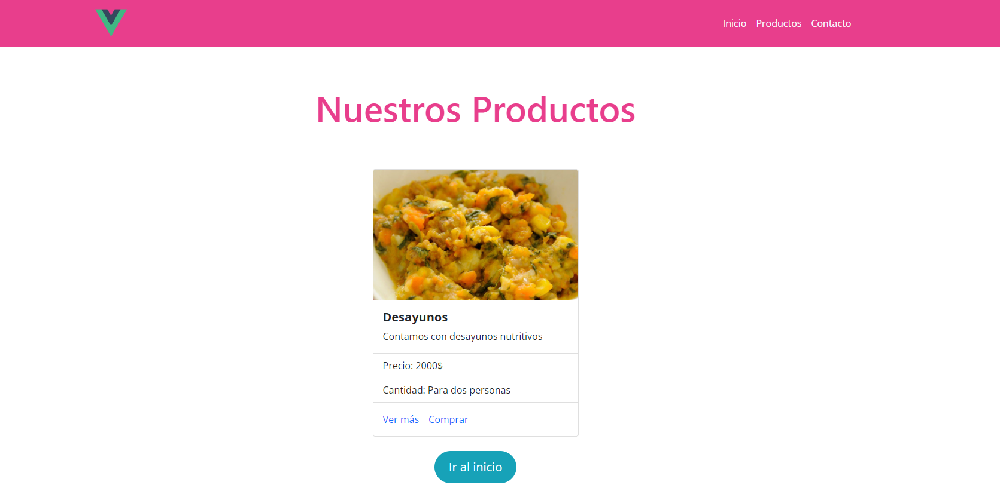
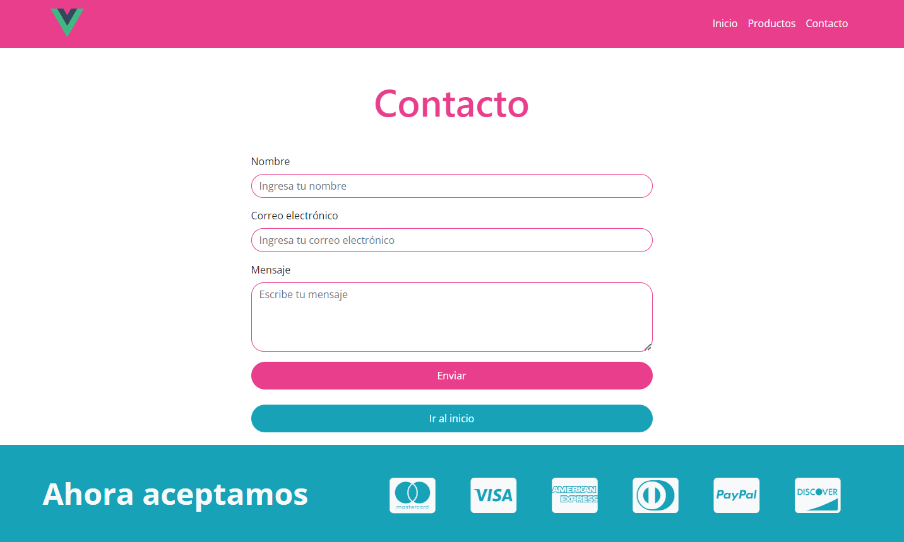

Desarrolladora: Ana Celeste Pérez

- [Desafío - Vue Router](#desafío---vue-router)
  - [Descripción](#descripción)
  - [Requerimientos](#requerimientos)
  - [Configuración de Vue Router](#configuración-de-vue-router)
  - [Crear las Vistas](#crear-las-vistas)
  - [Pruebas](#pruebas)
  - [Estructura del Proyecto](#estructura-del-proyecto)

# Desafío - Vue Router

## Descripción

Este desafío tiene como objetivo validar la implementación de Vue Router para gestionar la navegación en una interfaz web. Utilizando el código base proporcionado, debemos configurar y hacer funcionar un menú de navegación con Vue Router, así como crear las vistas correspondientes para cada ítem en la barra de navegación.

## Requerimientos

- **Implementar Vue Router**: Configurar y usar Vue Router para la navegación entre diferentes vistas.

- **Crear Vistas**: Desarrollar vistas correspondientes para los ítems en la barra de navegación.(No era necesario crear una estructura compleja, pero si que se denotara que se hace el cambio entre links.)

- **Código Base**: Utilizar el archivo “Apoyo Desafío - Código base desafío vue router” como base para la solución.

## Configuración de Vue Router

1. **Configurar el Router**:
   - Abre el archivo de configuración de rutas (por lo general `src/router/index.js`).
  
   - Define las rutas necesarias para cada vista especificada en la barra de navegación.

   - Asegúrate de importar los componentes correspondientes para cada ruta.

2. **Actualizar la Barra de Navegación**:
   - Modifica el componente de la barra de navegación(`src/components/Navbar.vue`) para que utilice `<router-link>` en lugar de enlaces HTML normales. Por ejemplo: [enlace que redirige al contacto](./src/components/Navbar.vue#L25)

## Crear las Vistas

1. **Desarrollar Vistas**:
   - Crea archivos de vista en la carpeta `src/views` para cada ítem en la barra de navegación. Por ejemplo, si tienes enlaces a "Inicio", "Productos" y "Contacto", crea los archivos `Home.vue`, `Producto.vue` y `Contacto.vue` respectivamente.
  
   - Cada archivo de vista debe contener el contenido relevante para su sección.   
   - [Volver al Inicio](#desafío---vue-router)

## Pruebas

1. **Verificar Navegación**:
   - Asegúrate de que cada enlace en la barra de navegación dirija al componente correcto y que la navegación funcione sin problemas.

2. **Pruebas Adicionales**:
   - Verifica que las vistas se carguen correctamente y que el contenido se muestre como se espera.

## Estructura del Proyecto

- **`src/components/Card.vue`**: Componente de la Carta(Menu).
- **`src/components/Footer.vue`**: Componente del Footer.
- **`src/components/MeidosPago.vue`**: Componente de la barra de navegación.
- **`src/components/Navbar.vue`**: Componente de la barra de navegación.
- **`src/router/index.js`**: Configuración de rutas.
- **`src/views/ContactView.vue`**: Vista para la página de contacto.
- **`src/views/HomeView.vue`**: Vista para la página de inicio.
- **`src/views/ProductoView.vue`**: Vista para la página de productos.   
 [Volver al Inicio](#desafío---vue-router)

